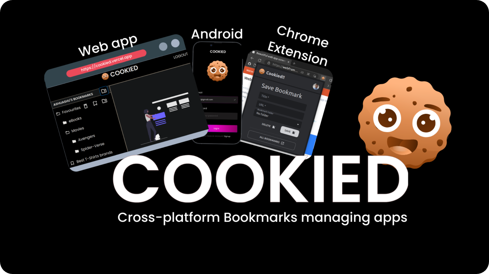
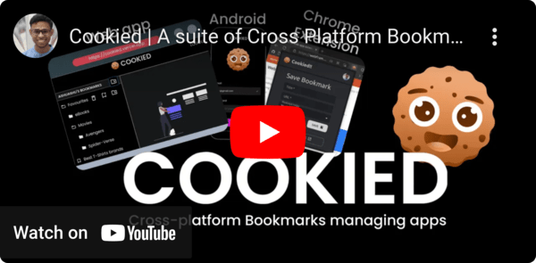

# Cookied!!

Cookied is a suite of cross-platform apps designed to revolutionize how you save and organize your bookmarks. It's available as a web app with a companion Chrome extension and an Android app. Built with Convex BaaS, Next.js, React Native, and Vite.

This project proudly participates in the [WDC Hackathon](https://hackathon.webdevcody.com/), sponsored by Convex and Web Dev Cody. It's a Mono repo project with the following client-side apps:

- **Cookied for Desktop Browsers**
  - [Web App](http://cookiedapi.vercel.app/api/get/webapp)
  - [Companion Chrome Extension](https://cookiedapi.vercel.app/api/get/chrome-ext)

- **Cookied for Android Browsers**
  - [Scan the QR code to install the Android app](https://cookiedapi.vercel.app/api/get/android-qr)
  - [Download the APK](https://cookiedapi.vercel.app/api/get/android-dl)

## The Origin Story of Cookied 🍪

Today we all rely on popular browsers equipped with built-in bookmark managers. Sure, they come with mobile apps to sync our bookmarks seamlessly across devices, but there's a catch. These built-in managers offer a rather limited set of features, often leaving us craving for a richer user experience. 

**But hold on!** While the built-in browser bookmarks manager might efficiently sync your bookmarks within the confines of a particular browser brand, it falls short when you want to sync across different browser brands.

Now, you might argue that there are alternative feature-packed bookmark managers as Chrome extensions in the Web Store. But here's the kicker - are they truly cross-platform? Can you seamlessly use those Chrome extensions with your smartphone browsers? Unfortunately, the answer is a resounding NO.

Enter Cookied! 🌐 A cross-platform browser bookmarks manager designed to empower you to effortlessly manage and sync your bookmarks, regardless of the device or browser brand you prefer. 

And that's not all! *Cookied goes beyond the ordinary* with features like **fuzzy search**, enabling you to find your bookmarks effortlessly. Ever tried describing your ancient-long-forgotten bookmarks in words to an **AI Vector Search**? With Cookied, now you can!

But wait, there's more to come! 🚀 We're actively working on a list of upcoming features to make your browsing experience even more delightful. Check out the exciting ideas in our [TODO.md](./TODO.md) file! Stay tuned for more Cookied goodness. 🍪✨

## Demo Video

Check out this YouTube video for the app walkthroughs!!

## 🤝🏽🍀 Contributing Guidelines 

**Excited to fix a bug or add a brilliant feature?**
Explore our [contributing guidelines](.github/docs/CONTRIBUTING.md)!

Also, check out the Idea List in [TODO.md](./TODO.md).

---

✨ **Evolving Brilliance ⭐**

This repository is in a constant state of refinement and is destined to become an awesome productivity tool.

Stargazers, you're the silent supporters who recognize the potential, and followers, you're on this journey with us.

Exciting features are in the pipeline, set to transform your user experience. ⚙️ Stay tuned! 🌟
